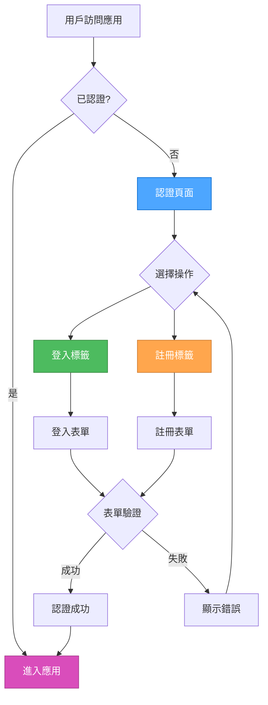

# 認證系統 UI/UX 設計

## 設計概述

**選擇的設計**: 統一認證頁面設計
**設計原則**: 用戶體驗優先，遵循樣式指南
**目標**: 創建直觀、無障礙、響應式的認證界面

## 用戶流程設計



## 頁面佈局設計

### 整體佈局
```tsx
// 認證頁面佈局
<div className="min-h-screen flex items-center justify-center bg-background p-4">
  <div className="w-full max-w-md space-y-6">
    {/* Logo 和標題 */}
    <div className="text-center space-y-2">
      <Logo />
      <h1 className="text-2xl font-semibold">歡迎使用 Twilight-Hub</h1>
      <p className="text-sm text-muted-foreground">
        登入或註冊以開始使用
      </p>
    </div>
    
    {/* 認證表單 */}
    <Card>
      <CardContent className="p-6">
        <AuthForm />
      </CardContent>
    </Card>
    
    {/* 額外信息 */}
    <div className="text-center text-xs text-muted-foreground">
      <p>繼續使用即表示您同意我們的服務條款</p>
    </div>
  </div>
</div>
```

### 響應式設計
- **桌面端**: 固定寬度的卡片佈局
- **平板端**: 適中的寬度，保持居中
- **移動端**: 全寬佈局，最小邊距

## 組件設計

### 1. 認證表單組件

```tsx
// src/components/auth/auth-form.tsx
'use client';

import { useState } from 'react';
import { Tabs, TabsContent, TabsList, TabsTrigger } from '@/components/ui/tabs';
import { LoginForm } from './login-form';
import { RegisterForm } from './register-form';

export function AuthForm() {
  const [activeTab, setActiveTab] = useState('login');

  return (
    <Tabs value={activeTab} onValueChange={setActiveTab} className="w-full">
      <TabsList className="grid w-full grid-cols-2">
        <TabsTrigger value="login">登入</TabsTrigger>
        <TabsTrigger value="register">註冊</TabsTrigger>
      </TabsList>
      
      <TabsContent value="login" className="space-y-4 mt-6">
        <LoginForm />
      </TabsContent>
      
      <TabsContent value="register" className="space-y-4 mt-6">
        <RegisterForm />
      </TabsContent>
    </Tabs>
  );
}
```

### 2. 登入表單組件

```tsx
// src/components/auth/login-form.tsx
'use client';

import { useState } from 'react';
import { useRouter } from 'next/navigation';
import { Button } from '@/components/ui/button';
import { Input } from '@/components/ui/input';
import { Label } from '@/components/ui/label';
import { Alert, AlertDescription } from '@/components/ui/alert';
import { Loader2 } from 'lucide-react';
import { AuthService } from '@/firebase/auth';
import { useAuth } from '@/hooks/use-auth';

export function LoginForm() {
  const [email, setEmail] = useState('');
  const [password, setPassword] = useState('');
  const [isLoading, setIsLoading] = useState(false);
  const [error, setError] = useState('');
  
  const router = useRouter();
  const { signIn } = useAuth();

  const handleSubmit = async (e: React.FormEvent) => {
    e.preventDefault();
    setIsLoading(true);
    setError('');

    try {
      await signIn(email, password);
      router.push('/dashboard');
    } catch (error) {
      setError(error instanceof Error ? error.message : '登入失敗');
    } finally {
      setIsLoading(false);
    }
  };

  return (
    <form onSubmit={handleSubmit} className="space-y-4">
      {error && (
        <Alert variant="destructive">
          <AlertDescription>{error}</AlertDescription>
        </Alert>
      )}
      
      <div className="space-y-2">
        <Label htmlFor="email">電子郵件</Label>
        <Input
          id="email"
          type="email"
          placeholder="your@email.com"
          value={email}
          onChange={(e) => setEmail(e.target.value)}
          required
          disabled={isLoading}
          className="w-full"
        />
      </div>
      
      <div className="space-y-2">
        <Label htmlFor="password">密碼</Label>
        <Input
          id="password"
          type="password"
          placeholder="••••••••"
          value={password}
          onChange={(e) => setPassword(e.target.value)}
          required
          disabled={isLoading}
          className="w-full"
        />
      </div>
      
      <Button type="submit" className="w-full" disabled={isLoading}>
        {isLoading && <Loader2 className="mr-2 h-4 w-4 animate-spin" />}
        登入
      </Button>
      
      <div className="text-center">
        <Button variant="link" size="sm" className="text-xs">
          忘記密碼？
        </Button>
      </div>
    </form>
  );
}
```

### 3. 註冊表單組件

```tsx
// src/components/auth/register-form.tsx
'use client';

import { useState } from 'react';
import { useRouter } from 'next/navigation';
import { Button } from '@/components/ui/button';
import { Input } from '@/components/ui/input';
import { Label } from '@/components/ui/label';
import { Alert, AlertDescription } from '@/components/ui/alert';
import { Checkbox } from '@/components/ui/checkbox';
import { Loader2 } from 'lucide-react';
import { useAuth } from '@/hooks/use-auth';

export function RegisterForm() {
  const [formData, setFormData] = useState({
    displayName: '',
    email: '',
    password: '',
    confirmPassword: '',
    agreeToTerms: false,
  });
  const [isLoading, setIsLoading] = useState(false);
  const [error, setError] = useState('');
  
  const router = useRouter();
  const { signUp } = useAuth();

  const handleSubmit = async (e: React.FormEvent) => {
    e.preventDefault();
    setIsLoading(true);
    setError('');

    // 表單驗證
    if (formData.password !== formData.confirmPassword) {
      setError('密碼確認不匹配');
      setIsLoading(false);
      return;
    }

    if (!formData.agreeToTerms) {
      setError('請同意服務條款');
      setIsLoading(false);
      return;
    }

    try {
      await signUp(formData.email, formData.password, formData.displayName);
      router.push('/dashboard');
    } catch (error) {
      setError(error instanceof Error ? error.message : '註冊失敗');
    } finally {
      setIsLoading(false);
    }
  };

  const handleInputChange = (field: string, value: string | boolean) => {
    setFormData(prev => ({ ...prev, [field]: value }));
  };

  return (
    <form onSubmit={handleSubmit} className="space-y-4">
      {error && (
        <Alert variant="destructive">
          <AlertDescription>{error}</AlertDescription>
        </Alert>
      )}
      
      <div className="space-y-2">
        <Label htmlFor="displayName">顯示名稱</Label>
        <Input
          id="displayName"
          type="text"
          placeholder="您的姓名"
          value={formData.displayName}
          onChange={(e) => handleInputChange('displayName', e.target.value)}
          disabled={isLoading}
          className="w-full"
        />
      </div>
      
      <div className="space-y-2">
        <Label htmlFor="email">電子郵件</Label>
        <Input
          id="email"
          type="email"
          placeholder="your@email.com"
          value={formData.email}
          onChange={(e) => handleInputChange('email', e.target.value)}
          required
          disabled={isLoading}
          className="w-full"
        />
      </div>
      
      <div className="space-y-2">
        <Label htmlFor="password">密碼</Label>
        <Input
          id="password"
          type="password"
          placeholder="••••••••"
          value={formData.password}
          onChange={(e) => handleInputChange('password', e.target.value)}
          required
          disabled={isLoading}
          className="w-full"
        />
      </div>
      
      <div className="space-y-2">
        <Label htmlFor="confirmPassword">確認密碼</Label>
        <Input
          id="confirmPassword"
          type="password"
          placeholder="••••••••"
          value={formData.confirmPassword}
          onChange={(e) => handleInputChange('confirmPassword', e.target.value)}
          required
          disabled={isLoading}
          className="w-full"
        />
      </div>
      
      <div className="flex items-center space-x-2">
        <Checkbox
          id="agreeToTerms"
          checked={formData.agreeToTerms}
          onCheckedChange={(checked) => handleInputChange('agreeToTerms', checked)}
          disabled={isLoading}
        />
        <Label htmlFor="agreeToTerms" className="text-sm">
          我同意服務條款和隱私政策
        </Label>
      </div>
      
      <Button type="submit" className="w-full" disabled={isLoading}>
        {isLoading && <Loader2 className="mr-2 h-4 w-4 animate-spin" />}
        註冊
      </Button>
    </form>
  );
}
```

## 視覺設計規範

### 顏色使用
- **主要按鈕**: 使用 `primary` 顏色
- **次要按鈕**: 使用 `outline` 變體
- **錯誤狀態**: 使用 `destructive` 顏色
- **成功狀態**: 使用綠色調
- **禁用狀態**: 使用 `disabled` 樣式

### 字體和間距
- **標題**: `text-2xl font-semibold`
- **表單標籤**: `text-sm font-medium`
- **輸入框**: `h-10 px-3`
- **按鈕**: `h-10 px-4`
- **卡片間距**: `p-6`
- **表單間距**: `space-y-4`

### 響應式設計
```css
/* 移動端優化 */
@media (max-width: 640px) {
  .auth-container {
    @apply px-4 py-6;
  }
  
  .auth-card {
    @apply mx-2;
  }
}

/* 平板端優化 */
@media (min-width: 641px) and (max-width: 1024px) {
  .auth-container {
    @apply px-8;
  }
}

/* 桌面端優化 */
@media (min-width: 1025px) {
  .auth-container {
    @apply px-12;
  }
}
```

## 無障礙設計

### 鍵盤導航
- 所有可交互元素都支持鍵盤導航
- Tab 順序邏輯清晰
- 使用 `focus-visible` 提供清晰的焦點指示

### 屏幕閱讀器支持
```tsx
// 表單標籤和輸入框關聯
<Label htmlFor="email">電子郵件</Label>
<Input id="email" aria-describedby="email-error" />

// 錯誤信息關聯
{error && (
  <Alert id="email-error" role="alert" aria-live="polite">
    <AlertDescription>{error}</AlertDescription>
  </Alert>
)}

// 表單狀態描述
<Button aria-describedby="loading-text" disabled={isLoading}>
  {isLoading && <Loader2 aria-hidden="true" />}
  登入
  {isLoading && <span id="loading-text" className="sr-only">正在登入...</span>}
</Button>
```

### ARIA 屬性
- `aria-live="polite"` 用於動態錯誤信息
- `aria-describedby` 關聯錯誤信息
- `aria-hidden="true"` 隱藏裝飾性圖標
- `role="alert"` 標記錯誤信息

## 動畫和過渡

### 表單切換動畫
```css
.tab-content {
  animation: fadeIn 0.2s ease-in-out;
}

@keyframes fadeIn {
  from {
    opacity: 0;
    transform: translateY(10px);
  }
  to {
    opacity: 1;
    transform: translateY(0);
  }
}
```

### 加載狀態動畫
- 按鈕加載狀態使用旋轉動畫
- 表單提交時顯示進度指示器
- 錯誤信息淡入動畫

## 錯誤處理設計

### 錯誤類型
1. **驗證錯誤**: 即時顯示在表單字段下方
2. **網絡錯誤**: 顯示在表單頂部
3. **認證錯誤**: 顯示具體的錯誤信息

### 錯誤信息設計
```tsx
// 字段級錯誤
<div className="space-y-2">
  <Input 
    className={cn(
      "w-full",
      fieldError && "border-destructive focus-visible:ring-destructive"
    )}
  />
  {fieldError && (
    <p className="text-sm text-destructive">{fieldError}</p>
  )}
</div>

// 表單級錯誤
{error && (
  <Alert variant="destructive" className="mb-4">
    <AlertCircle className="h-4 w-4" />
    <AlertDescription>{error}</AlertDescription>
  </Alert>
)}
```

## 深色模式支持

### 顏色適配
- 所有顏色使用 CSS 變數
- 自動適配淺色/深色模式
- 保持對比度符合 WCAG 標準

### 深色模式測試
- 在深色模式下測試所有組件
- 確保文字可讀性
- 驗證按鈕和輸入框的可見性

## 性能優化

### 代碼分割
```tsx
// 懶加載認證組件
const AuthForm = lazy(() => import('@/components/auth/auth-form'));

// 使用 Suspense 包裝
<Suspense fallback={<AuthFormSkeleton />}>
  <AuthForm />
</Suspense>
```

### 表單優化
- 使用 `useCallback` 優化事件處理器
- 實現表單字段防抖
- 避免不必要的重新渲染

## 測試策略

### 視覺測試
- 截圖測試確保 UI 一致性
- 響應式設計測試
- 深色模式視覺測試

### 功能測試
- 表單驗證測試
- 錯誤處理測試
- 鍵盤導航測試

### 無障礙測試
- 屏幕閱讀器測試
- 鍵盤導航測試
- 對比度測試

## 實施計劃

### 階段 1: 基礎組件 (2-3 天)
1. 創建認證表單組件
2. 實現登入/註冊表單
3. 添加基礎樣式

### 階段 2: 交互功能 (2-3 天)
1. 實現表單驗證
2. 添加錯誤處理
3. 實現加載狀態

### 階段 3: 無障礙和優化 (1-2 天)
1. 添加 ARIA 屬性
2. 實現鍵盤導航
3. 性能優化

### 階段 4: 測試和調試 (1-2 天)
1. 功能測試
2. 無障礙測試
3. 跨瀏覽器測試

## 驗證標準

### 功能驗證
- [ ] 登入功能正常工作
- [ ] 註冊功能正常工作
- [ ] 表單驗證正確顯示
- [ ] 錯誤處理適當

### 無障礙驗證
- [ ] 鍵盤導航順暢
- [ ] 屏幕閱讀器兼容
- [ ] 對比度符合標準
- [ ] 焦點指示清晰

### 響應式驗證
- [ ] 移動端佈局正確
- [ ] 平板端佈局正確
- [ ] 桌面端佈局正確
- [ ] 深色模式正常

## 總結

這個認證系統 UI/UX 設計提供了：

1. **優秀的用戶體驗**: 統一頁面設計，減少跳轉
2. **完整的無障礙支持**: 符合 WCAG 2.1 AA 標準
3. **響應式設計**: 在所有設備上都能良好工作
4. **一致的視覺風格**: 遵循樣式指南
5. **健壯的錯誤處理**: 清晰的錯誤反饋
6. **良好的性能**: 優化的代碼和動畫

這個設計為用戶提供了直觀、安全、無障礙的認證體驗，同時保持了與整個應用設計系統的一致性。
