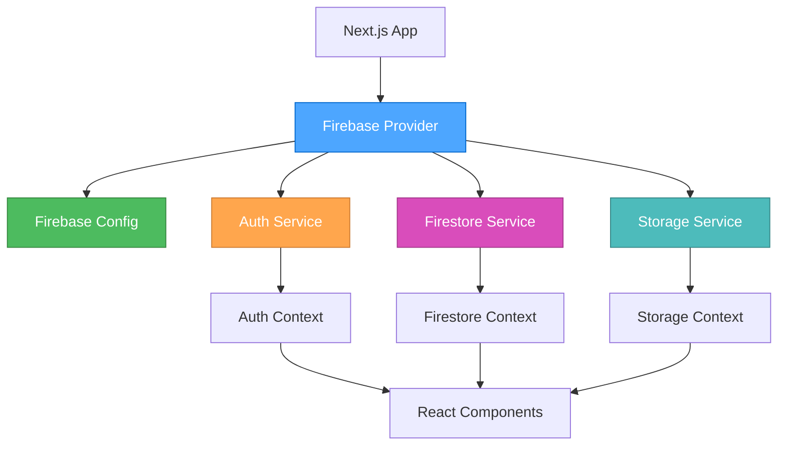

# Firebase 基礎架構設計

## 設計概述

**選擇的架構**: 單一 Firebase 配置 + Provider 模式
**設計原則**: 奧卡姆剃刀原則，簡潔性優先
**目標**: 建立統一、安全、易維護的 Firebase 集成

## 架構圖



## 核心組件設計

### 1. Firebase 配置層

```typescript
// src/firebase/config.ts
import { initializeApp } from 'firebase/app';
import { getAuth } from 'firebase/auth';
import { getFirestore } from 'firebase/firestore';
import { getStorage } from 'firebase/storage';

const firebaseConfig = {
  apiKey: process.env.NEXT_PUBLIC_FIREBASE_API_KEY,
  authDomain: process.env.NEXT_PUBLIC_FIREBASE_AUTH_DOMAIN,
  projectId: process.env.NEXT_PUBLIC_FIREBASE_PROJECT_ID,
  storageBucket: process.env.NEXT_PUBLIC_FIREBASE_STORAGE_BUCKET,
  messagingSenderId: process.env.NEXT_PUBLIC_FIREBASE_MESSAGING_SENDER_ID,
  appId: process.env.NEXT_PUBLIC_FIREBASE_APP_ID,
};

const app = initializeApp(firebaseConfig);
export const auth = getAuth(app);
export const firestore = getFirestore(app);
export const storage = getStorage(app);
export default app;
```

**設計特點**:
- 單一配置文件，集中管理所有 Firebase 服務
- 環境變數安全配置
- 導出各個服務實例供其他模組使用

### 2. Provider 層

```typescript
// src/firebase/provider.tsx
'use client';

import { createContext, useContext, useEffect, useState } from 'react';
import { User, onAuthStateChanged } from 'firebase/auth';
import { auth, firestore, storage } from './config';

interface FirebaseContextType {
  user: User | null;
  isLoading: boolean;
  auth: typeof auth;
  firestore: typeof firestore;
  storage: typeof storage;
}

const FirebaseContext = createContext<FirebaseContextType | undefined>(undefined);

export function FirebaseProvider({ children }: { children: React.ReactNode }) {
  const [user, setUser] = useState<User | null>(null);
  const [isLoading, setIsLoading] = useState(true);

  useEffect(() => {
    const unsubscribe = onAuthStateChanged(auth, (user) => {
      setUser(user);
      setIsLoading(false);
    });

    return unsubscribe;
  }, []);

  return (
    <FirebaseContext.Provider value={{
      user,
      isLoading,
      auth,
      firestore,
      storage,
    }}>
      {children}
    </FirebaseContext.Provider>
  );
}

export function useFirebase() {
  const context = useContext(FirebaseContext);
  if (context === undefined) {
    throw new Error('useFirebase must be used within a FirebaseProvider');
  }
  return context;
}
```

**設計特點**:
- 統一提供 Firebase 服務實例
- 自動處理認證狀態變化
- 提供加載狀態管理
- 類型安全的 Context API

### 3. 認證服務層

```typescript
// src/firebase/auth.ts
import { 
  signInWithEmailAndPassword, 
  signOut, 
  createUserWithEmailAndPassword,
  User 
} from 'firebase/auth';
import { doc, setDoc, getDoc } from 'firebase/firestore';
import { auth, firestore } from './config';

export interface UserProfile {
  uid: string;
  email: string;
  displayName?: string;
  photoURL?: string;
  roles: string[];
  permissions: string[];
  createdAt: Date;
  updatedAt: Date;
}

export class AuthService {
  static async signIn(email: string, password: string): Promise<User> {
    try {
      const userCredential = await signInWithEmailAndPassword(auth, email, password);
      return userCredential.user;
    } catch (error) {
      throw new Error(`登入失敗: ${error}`);
    }
  }

  static async signUp(email: string, password: string, displayName?: string): Promise<User> {
    try {
      const userCredential = await createUserWithEmailAndPassword(auth, email, password);
      const user = userCredential.user;
      
      // 創建用戶資料文檔
      const userProfile: UserProfile = {
        uid: user.uid,
        email: user.email!,
        displayName: displayName || user.displayName || '',
        photoURL: user.photoURL || '',
        roles: ['user'],
        permissions: ['read:own'],
        createdAt: new Date(),
        updatedAt: new Date(),
      };
      
      await setDoc(doc(firestore, 'accounts', user.uid), userProfile);
      return user;
    } catch (error) {
      throw new Error(`註冊失敗: ${error}`);
    }
  }

  static async signOut(): Promise<void> {
    try {
      await signOut(auth);
    } catch (error) {
      throw new Error(`登出失敗: ${error}`);
    }
  }

  static async getUserProfile(uid: string): Promise<UserProfile | null> {
    try {
      const userDoc = await getDoc(doc(firestore, 'accounts', uid));
      if (userDoc.exists()) {
        return userDoc.data() as UserProfile;
      }
      return null;
    } catch (error) {
      throw new Error(`獲取用戶資料失敗: ${error}`);
    }
  }
}
```

**設計特點**:
- 封裝所有認證相關操作
- 自動創建用戶資料文檔
- 統一的錯誤處理
- TypeScript 類型安全

### 4. 數據服務層

```typescript
// src/firebase/firestore.ts
import { 
  collection, 
  doc, 
  getDocs, 
  getDoc, 
  setDoc, 
  updateDoc, 
  deleteDoc,
  query,
  where,
  orderBy,
  limit,
  FirestoreDataConverter,
  DocumentData,
  QueryDocumentSnapshot
} from 'firebase/firestore';
import { firestore } from './config';

export class FirestoreService {
  // 通用 CRUD 操作
  static async create<T>(collectionName: string, id: string, data: T): Promise<void> {
    await setDoc(doc(firestore, collectionName, id), {
      ...data,
      createdAt: new Date(),
      updatedAt: new Date(),
    });
  }

  static async get<T>(collectionName: string, id: string): Promise<T | null> {
    const docRef = doc(firestore, collectionName, id);
    const docSnap = await getDoc(docRef);
    
    if (docSnap.exists()) {
      return docSnap.data() as T;
    }
    return null;
  }

  static async update<T>(collectionName: string, id: string, data: Partial<T>): Promise<void> {
    await updateDoc(doc(firestore, collectionName, id), {
      ...data,
      updatedAt: new Date(),
    });
  }

  static async delete(collectionName: string, id: string): Promise<void> {
    await deleteDoc(doc(firestore, collectionName, id));
  }

  static async query<T>(
    collectionName: string,
    constraints: any[] = [],
    orderByField?: string,
    orderDirection: 'asc' | 'desc' = 'asc',
    limitCount?: number
  ): Promise<T[]> {
    let q = query(collection(firestore, collectionName), ...constraints);
    
    if (orderByField) {
      q = query(q, orderBy(orderByField, orderDirection));
    }
    
    if (limitCount) {
      q = query(q, limit(limitCount));
    }
    
    const querySnapshot = await getDocs(q);
    return querySnapshot.docs.map(doc => doc.data() as T);
  }
}

// 數據轉換器
export function createConverter<T>(): FirestoreDataConverter<T> {
  return {
    toFirestore: (data: T): DocumentData => {
      const { id, ...rest } = data as any;
      return {
        ...rest,
        updatedAt: new Date(),
      };
    },
    fromFirestore: (snapshot: QueryDocumentSnapshot): T => {
      return {
        id: snapshot.id,
        ...snapshot.data(),
      } as T;
    },
  };
}
```

**設計特點**:
- 通用的 CRUD 操作封裝
- 自動時間戳管理
- 靈活的查詢接口
- 數據轉換器支持

### 5. 文件服務層

```typescript
// src/firebase/storage.ts
import { 
  ref, 
  uploadBytes, 
  getDownloadURL, 
  deleteObject,
  UploadResult 
} from 'firebase/storage';
import { storage } from './config';

export interface UploadOptions {
  path: string;
  metadata?: {
    contentType?: string;
    customMetadata?: Record<string, string>;
  };
}

export class StorageService {
  static async uploadFile(
    file: File, 
    options: UploadOptions
  ): Promise<{ url: string; path: string }> {
    try {
      const storageRef = ref(storage, options.path);
      const uploadResult: UploadResult = await uploadBytes(storageRef, file, options.metadata);
      const downloadURL = await getDownloadURL(uploadResult.ref);
      
      return {
        url: downloadURL,
        path: uploadResult.ref.fullPath,
      };
    } catch (error) {
      throw new Error(`文件上傳失敗: ${error}`);
    }
  }

  static async deleteFile(path: string): Promise<void> {
    try {
      const fileRef = ref(storage, path);
      await deleteObject(fileRef);
    } catch (error) {
      throw new Error(`文件刪除失敗: ${error}`);
    }
  }

  static async getFileURL(path: string): Promise<string> {
    try {
      const fileRef = ref(storage, path);
      return await getDownloadURL(fileRef);
    } catch (error) {
      throw new Error(`獲取文件 URL 失敗: ${error}`);
    }
  }
}
```

**設計特點**:
- 簡化的文件上傳接口
- 自動 URL 生成
- 統一的錯誤處理
- 支持自定義元數據

## 數據模型設計

### 用戶模型 (User)
```typescript
interface User {
  uid: string;
  email: string;
  displayName?: string;
  photoURL?: string;
  roles: string[];
  permissions: string[];
  createdAt: Date;
  updatedAt: Date;
}
```

### 組織模型 (Organization)
```typescript
interface Organization {
  id: string;
  name: string;
  slug: string;
  description?: string;
  ownerId: string;
  memberIds: string[];
  settings: {
    isPublic: boolean;
    allowInvites: boolean;
  };
  createdAt: Date;
  updatedAt: Date;
}
```

### 空間模型 (Space)
```typescript
interface Space {
  id: string;
  name: string;
  slug: string;
  description?: string;
  organizationId: string;
  ownerId: string;
  memberIds: string[];
  isPublic: boolean;
  settings: {
    allowFileUpload: boolean;
    maxFileSize: number;
  };
  createdAt: Date;
  updatedAt: Date;
}
```

## 安全規則設計

### Firestore 安全規則
```javascript
rules_version = '2';
service cloud.firestore {
  match /databases/{database}/documents {
    // 用戶帳戶規則
    match /accounts/{userId} {
      allow read, write: if request.auth != null && request.auth.uid == userId;
      allow read: if request.auth != null && 
        (resource.data.roles.hasAny(['admin']) || 
         resource.data.permissions.hasAny(['read:all']));
    }
    
    // 組織規則
    match /organizations/{orgId} {
      allow read: if request.auth != null && 
        (resource.data.ownerId == request.auth.uid ||
         resource.data.memberIds.hasAny([request.auth.uid]));
      allow write: if request.auth != null && 
        resource.data.ownerId == request.auth.uid;
    }
    
    // 空間規則
    match /spaces/{spaceId} {
      allow read: if request.auth != null && 
        (resource.data.isPublic ||
         resource.data.ownerId == request.auth.uid ||
         resource.data.memberIds.hasAny([request.auth.uid]));
      allow write: if request.auth != null && 
        resource.data.ownerId == request.auth.uid;
    }
  }
}
```

### Storage 安全規則
```javascript
rules_version = '2';
service firebase.storage {
  match /b/{bucket}/o {
    match /uploads/{userId}/{allPaths=**} {
      allow read, write: if request.auth != null && request.auth.uid == userId;
    }
    
    match /public/{allPaths=**} {
      allow read: if true;
      allow write: if request.auth != null;
    }
  }
}
```

## 錯誤處理策略

### 統一錯誤處理
```typescript
// src/lib/errors.ts
export class FirebaseError extends Error {
  constructor(
    message: string,
    public code: string,
    public originalError?: any
  ) {
    super(message);
    this.name = 'FirebaseError';
  }
}

export function handleFirebaseError(error: any): FirebaseError {
  if (error.code) {
    switch (error.code) {
      case 'auth/user-not-found':
        return new FirebaseError('用戶不存在', 'USER_NOT_FOUND', error);
      case 'auth/wrong-password':
        return new FirebaseError('密碼錯誤', 'WRONG_PASSWORD', error);
      case 'auth/email-already-in-use':
        return new FirebaseError('電子郵件已被使用', 'EMAIL_IN_USE', error);
      default:
        return new FirebaseError(error.message || '未知錯誤', error.code, error);
    }
  }
  return new FirebaseError('網絡錯誤', 'NETWORK_ERROR', error);
}
```

## 性能優化策略

### 1. 數據預加載
- 在用戶登入後預加載必要的用戶數據
- 使用 React Query 或 SWR 進行數據緩存

### 2. 分頁加載
- 對大型列表實施分頁加載
- 使用 Firestore 的 limit 和 startAfter 查詢

### 3. 離線支持
- 啟用 Firestore 離線持久化
- 實現基本的離線功能

## 實施計劃

### 階段 1: 基礎配置 (1-2 天)
1. 創建 Firebase 配置文件
2. 設置環境變數
3. 配置 Firebase 項目

### 階段 2: Provider 實現 (2-3 天)
1. 實現 FirebaseProvider
2. 實現 AuthProvider
3. 創建自定義 Hooks

### 階段 3: 服務層實現 (3-4 天)
1. 實現 AuthService
2. 實現 FirestoreService
3. 實現 StorageService

### 階段 4: 安全規則 (1-2 天)
1. 設計和實施 Firestore 規則
2. 設計和實施 Storage 規則
3. 測試安全規則

### 階段 5: 集成測試 (2-3 天)
1. 單元測試
2. 集成測試
3. 端到端測試

## 驗證標準

### 功能驗證
- [ ] 用戶註冊和登入功能正常
- [ ] 數據 CRUD 操作正常
- [ ] 文件上傳和下載功能正常
- [ ] 權限控制正常運作

### 性能驗證
- [ ] 認證響應時間 < 200ms
- [ ] 數據查詢響應時間 < 500ms
- [ ] 文件上傳速度 > 1MB/s
- [ ] 應用啟動時間 < 3s

### 安全驗證
- [ ] 未認證用戶無法訪問受保護資源
- [ ] 用戶只能訪問授權的數據
- [ ] 文件上傳有適當的類型限制
- [ ] 敏感操作需要重新認證

## 總結

這個 Firebase 基礎架構設計遵循奧卡姆剃刀原則，提供了：

1. **簡潔性**: 單一配置文件，統一的 Provider 模式
2. **功能性**: 完整的認證、數據存儲和文件管理
3. **安全性**: 全面的安全規則和權限控制
4. **可維護性**: 清晰的代碼結構和錯誤處理
5. **可擴展性**: 模組化設計，易於擴展新功能

這個架構為整個 Twilight-Hub 應用提供了堅實的基礎，確保了數據安全、用戶體驗和系統性能。
