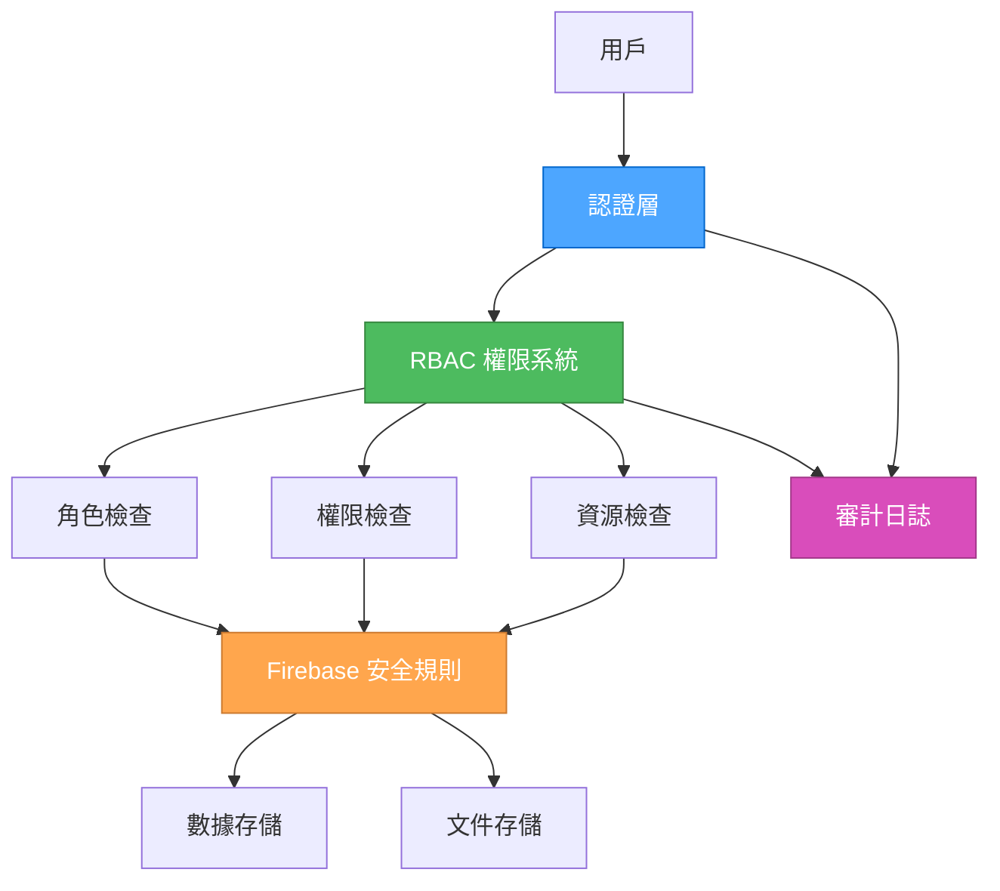

# 安全策略和權限管理設計

## 設計概述

**選擇的架構**: 混合權限系統
**設計原則**: 安全性優先，平衡複雜度和功能
**目標**: 建立完整的安全防護和權限控制體系

## 安全架構圖



## 權限模型設計

### 1. 角色定義

```typescript
// src/lib/permissions.ts
export enum UserRole {
  USER = 'user',
  ADMIN = 'admin',
  OWNER = 'owner',
  MODERATOR = 'moderator',
}

export enum Permission {
  // 用戶權限
  READ_OWN_PROFILE = 'read:own:profile',
  UPDATE_OWN_PROFILE = 'update:own:profile',
  
  // 組織權限
  READ_ORGANIZATION = 'read:organization',
  UPDATE_ORGANIZATION = 'update:organization',
  DELETE_ORGANIZATION = 'delete:organization',
  MANAGE_ORGANIZATION_MEMBERS = 'manage:organization:members',
  
  // 空間權限
  READ_SPACE = 'read:space',
  CREATE_SPACE = 'create:space',
  UPDATE_SPACE = 'update:space',
  DELETE_SPACE = 'delete:space',
  MANAGE_SPACE_MEMBERS = 'manage:space:members',
  
  // 文件權限
  READ_FILES = 'read:files',
  UPLOAD_FILES = 'upload:files',
  DELETE_FILES = 'delete:files',
  
  // 合約權限
  READ_CONTRACTS = 'read:contracts',
  CREATE_CONTRACTS = 'create:contracts',
  UPDATE_CONTRACTS = 'update:contracts',
  DELETE_CONTRACTS = 'delete:contracts',
}

// 角色權限映射
export const ROLE_PERMISSIONS: Record<UserRole, Permission[]> = {
  [UserRole.USER]: [
    Permission.READ_OWN_PROFILE,
    Permission.UPDATE_OWN_PROFILE,
    Permission.READ_ORGANIZATION,
    Permission.READ_SPACE,
    Permission.READ_FILES,
    Permission.READ_CONTRACTS,
  ],
  [UserRole.MODERATOR]: [
    ...ROLE_PERMISSIONS[UserRole.USER],
    Permission.UPDATE_SPACE,
    Permission.MANAGE_SPACE_MEMBERS,
    Permission.UPLOAD_FILES,
    Permission.CREATE_CONTRACTS,
    Permission.UPDATE_CONTRACTS,
  ],
  [UserRole.ADMIN]: [
    ...ROLE_PERMISSIONS[UserRole.MODERATOR],
    Permission.UPDATE_ORGANIZATION,
    Permission.MANAGE_ORGANIZATION_MEMBERS,
    Permission.CREATE_SPACE,
    Permission.DELETE_SPACE,
    Permission.DELETE_FILES,
    Permission.DELETE_CONTRACTS,
  ],
  [UserRole.OWNER]: [
    ...ROLE_PERMISSIONS[UserRole.ADMIN],
    Permission.DELETE_ORGANIZATION,
  ],
};
```

### 2. 權限檢查系統

```typescript
// src/lib/access-control.ts
import { Permission, UserRole, ROLE_PERMISSIONS } from './permissions';

export interface AccessContext {
  userId: string;
  userRoles: UserRole[];
  organizationId?: string;
  spaceId?: string;
  resourceOwnerId?: string;
}

export class AccessControl {
  /**
   * 檢查用戶是否有指定權限
   */
  static hasPermission(
    context: AccessContext,
    permission: Permission,
    resourceId?: string
  ): boolean {
    // 檢查角色權限
    const hasRolePermission = context.userRoles.some(role =>
      ROLE_PERMISSIONS[role].includes(permission)
    );

    if (!hasRolePermission) {
      return false;
    }

    // 檢查資源級權限
    return this.checkResourcePermission(context, permission, resourceId);
  }

  /**
   * 檢查資源級權限
   */
  private static checkResourcePermission(
    context: AccessContext,
    permission: Permission,
    resourceId?: string
  ): boolean {
    // 擁有者權限檢查
    if (context.resourceOwnerId === context.userId) {
      return true;
    }

    // 組織級權限檢查
    if (context.organizationId) {
      return this.checkOrganizationPermission(context, permission);
    }

    // 空間級權限檢查
    if (context.spaceId) {
      return this.checkSpacePermission(context, permission);
    }

    return true;
  }

  /**
   * 檢查組織權限
   */
  private static checkOrganizationPermission(
    context: AccessContext,
    permission: Permission
  ): boolean {
    // 這裡可以添加組織成員檢查邏輯
    // 例如檢查用戶是否為組織成員
    return true;
  }

  /**
   * 檢查空間權限
   */
  private static checkSpacePermission(
    context: AccessContext,
    permission: Permission
  ): boolean {
    // 這裡可以添加空間成員檢查邏輯
    // 例如檢查用戶是否為空間成員
    return true;
  }

  /**
   * 批量權限檢查
   */
  static hasAnyPermission(
    context: AccessContext,
    permissions: Permission[],
    resourceId?: string
  ): boolean {
    return permissions.some(permission =>
      this.hasPermission(context, permission, resourceId)
    );
  }

  /**
   * 檢查所有權限
   */
  static hasAllPermissions(
    context: AccessContext,
    permissions: Permission[],
    resourceId?: string
  ): boolean {
    return permissions.every(permission =>
      this.hasPermission(context, permission, resourceId)
    );
  }
}
```

## Firebase 安全規則

### 1. Firestore 安全規則

```javascript
// firestore.rules
rules_version = '2';
service cloud.firestore {
  match /databases/{database}/documents {
    // 用戶帳戶規則
    match /accounts/{userId} {
      allow read, write: if request.auth != null 
        && request.auth.uid == userId;
      allow read: if request.auth != null 
        && hasRolePermission(request.auth.uid, 'admin');
    }
    
    // 組織規則
    match /organizations/{orgId} {
      allow read: if request.auth != null 
        && (isOwner(request.auth.uid, orgId) 
            || isMember(request.auth.uid, orgId));
      allow create: if request.auth != null 
        && request.auth.uid == resource.data.ownerId;
      allow update, delete: if request.auth != null 
        && isOwner(request.auth.uid, orgId);
    }
    
    // 空間規則
    match /spaces/{spaceId} {
      allow read: if request.auth != null 
        && (resource.data.isPublic 
            || isOwner(request.auth.uid, spaceId)
            || isSpaceMember(request.auth.uid, spaceId));
      allow create: if request.auth != null 
        && isOrganizationMember(request.auth.uid, resource.data.organizationId);
      allow update, delete: if request.auth != null 
        && (isOwner(request.auth.uid, spaceId) 
            || hasRolePermission(request.auth.uid, 'admin'));
    }
    
    // 文件規則
    match /files/{fileId} {
      allow read: if request.auth != null 
        && (isFileOwner(request.auth.uid, fileId) 
            || isSpaceMember(request.auth.uid, resource.data.spaceId));
      allow create: if request.auth != null 
        && isSpaceMember(request.auth.uid, resource.data.spaceId);
      allow update, delete: if request.auth != null 
        && (isFileOwner(request.auth.uid, fileId) 
            || hasRolePermission(request.auth.uid, 'moderator'));
    }
    
    // 合約規則
    match /contracts/{contractId} {
      allow read: if request.auth != null 
        && (isContractOwner(request.auth.uid, contractId) 
            || isSpaceMember(request.auth.uid, resource.data.spaceId));
      allow create: if request.auth != null 
        && isSpaceMember(request.auth.uid, resource.data.spaceId);
      allow update, delete: if request.auth != null 
        && (isContractOwner(request.auth.uid, contractId) 
            || hasRolePermission(request.auth.uid, 'moderator'));
    }
    
    // 輔助函數
    function isOwner(userId, resourceId) {
      return get(/databases/$(database)/documents/organizations/$(resourceId)).data.ownerId == userId;
    }
    
    function isMember(userId, orgId) {
      return userId in get(/databases/$(database)/documents/organizations/$(orgId)).data.memberIds;
    }
    
    function isSpaceMember(userId, spaceId) {
      return userId in get(/databases/$(database)/documents/spaces/$(spaceId)).data.memberIds;
    }
    
    function hasRolePermission(userId, role) {
      return role in get(/databases/$(database)/documents/accounts/$(userId)).data.roles;
    }
    
    function isFileOwner(userId, fileId) {
      return get(/databases/$(database)/documents/files/$(fileId)).data.ownerId == userId;
    }
    
    function isContractOwner(userId, contractId) {
      return get(/databases/$(database)/documents/contracts/$(contractId)).data.ownerId == userId;
    }
    
    function isOrganizationMember(userId, orgId) {
      return userId in get(/databases/$(database)/documents/organizations/$(orgId)).data.memberIds;
    }
  }
}
```

### 2. Storage 安全規則

```javascript
// storage.rules
rules_version = '2';
service firebase.storage {
  match /b/{bucket}/o {
    // 用戶文件
    match /users/{userId}/{allPaths=**} {
      allow read, write: if request.auth != null 
        && request.auth.uid == userId;
    }
    
    // 組織文件
    match /organizations/{orgId}/{allPaths=**} {
      allow read: if request.auth != null 
        && isOrganizationMember(request.auth.uid, orgId);
      allow write: if request.auth != null 
        && (isOrganizationOwner(request.auth.uid, orgId) 
            || hasRolePermission(request.auth.uid, 'admin'));
    }
    
    // 空間文件
    match /spaces/{spaceId}/{allPaths=**} {
      allow read: if request.auth != null 
        && isSpaceMember(request.auth.uid, spaceId);
      allow write: if request.auth != null 
        && isSpaceMember(request.auth.uid, spaceId);
    }
    
    // 公開文件
    match /public/{allPaths=**} {
      allow read: if true;
      allow write: if request.auth != null;
    }
    
    // 輔助函數
    function isOrganizationMember(userId, orgId) {
      return firestore.get(/databases/(default)/documents/organizations/$(orgId)).data.memberIds.hasAny([userId]);
    }
    
    function isOrganizationOwner(userId, orgId) {
      return firestore.get(/databases/(default)/documents/organizations/$(orgId)).data.ownerId == userId;
    }
    
    function isSpaceMember(userId, spaceId) {
      return firestore.get(/databases/(default)/documents/spaces/$(spaceId)).data.memberIds.hasAny([userId]);
    }
    
    function hasRolePermission(userId, role) {
      return firestore.get(/databases/(default)/documents/accounts/$(userId)).data.roles.hasAny([role]);
    }
  }
}
```

## 權限檢查中間件

### 1. 權限檢查 Hook

```typescript
// src/hooks/use-permissions.ts
import { useAuth } from '@/providers/auth-provider';
import { AccessControl, AccessContext } from '@/lib/access-control';
import { Permission, UserRole } from '@/lib/permissions';

export function usePermissions() {
  const { user, userProfile } = useAuth();

  const hasPermission = (
    permission: Permission,
    resourceId?: string,
    additionalContext?: Partial<AccessContext>
  ): boolean => {
    if (!user || !userProfile) {
      return false;
    }

    const context: AccessContext = {
      userId: user.uid,
      userRoles: userProfile.roles as UserRole[],
      ...additionalContext,
    };

    return AccessControl.hasPermission(context, permission, resourceId);
  };

  const hasAnyPermission = (
    permissions: Permission[],
    resourceId?: string,
    additionalContext?: Partial<AccessContext>
  ): boolean => {
    if (!user || !userProfile) {
      return false;
    }

    const context: AccessContext = {
      userId: user.uid,
      userRoles: userProfile.roles as UserRole[],
      ...additionalContext,
    };

    return AccessControl.hasAnyPermission(context, permissions, resourceId);
  };

  const hasAllPermissions = (
    permissions: Permission[],
    resourceId?: string,
    additionalContext?: Partial<AccessContext>
  ): boolean => {
    if (!user || !userProfile) {
      return false;
    }

    const context: AccessContext = {
      userId: user.uid,
      userRoles: userProfile.roles as UserRole[],
      ...additionalContext,
    };

    return AccessControl.hasAllPermissions(context, permissions, resourceId);
  };

  return {
    hasPermission,
    hasAnyPermission,
    hasAllPermissions,
    userRoles: userProfile?.roles || [],
  };
}
```

### 2. 權限保護組件

```tsx
// src/components/auth/permission-guard.tsx
import { ReactNode } from 'react';
import { usePermissions } from '@/hooks/use-permissions';
import { Permission } from '@/lib/permissions';

interface PermissionGuardProps {
  permission: Permission;
  resourceId?: string;
  fallback?: ReactNode;
  children: ReactNode;
}

export function PermissionGuard({
  permission,
  resourceId,
  fallback = null,
  children,
}: PermissionGuardProps) {
  const { hasPermission } = usePermissions();

  if (!hasPermission(permission, resourceId)) {
    return <>{fallback}</>;
  }

  return <>{children}</>;
}

// 使用示例
<PermissionGuard 
  permission={Permission.UPDATE_SPACE} 
  resourceId={spaceId}
  fallback={<div>無權限訪問</div>}
>
  <EditSpaceButton />
</PermissionGuard>
```

## 審計日誌系統

### 1. 審計日誌模型

```typescript
// src/lib/audit.ts
export enum AuditAction {
  // 認證操作
  USER_LOGIN = 'user:login',
  USER_LOGOUT = 'user:logout',
  USER_REGISTER = 'user:register',
  
  // 組織操作
  ORGANIZATION_CREATE = 'organization:create',
  ORGANIZATION_UPDATE = 'organization:update',
  ORGANIZATION_DELETE = 'organization:delete',
  ORGANIZATION_MEMBER_ADD = 'organization:member:add',
  ORGANIZATION_MEMBER_REMOVE = 'organization:member:remove',
  
  // 空間操作
  SPACE_CREATE = 'space:create',
  SPACE_UPDATE = 'space:update',
  SPACE_DELETE = 'space:delete',
  SPACE_MEMBER_ADD = 'space:member:add',
  SPACE_MEMBER_REMOVE = 'space:member:remove',
  
  // 文件操作
  FILE_UPLOAD = 'file:upload',
  FILE_DOWNLOAD = 'file:download',
  FILE_DELETE = 'file:delete',
  
  // 合約操作
  CONTRACT_CREATE = 'contract:create',
  CONTRACT_UPDATE = 'contract:update',
  CONTRACT_DELETE = 'contract:delete',
  CONTRACT_ANALYZE = 'contract:analyze',
}

export interface AuditLog {
  id: string;
  userId: string;
  action: AuditAction;
  resourceType: string;
  resourceId: string;
  details: Record<string, any>;
  ipAddress?: string;
  userAgent?: string;
  timestamp: Date;
}

export class AuditLogger {
  static async log(
    userId: string,
    action: AuditAction,
    resourceType: string,
    resourceId: string,
    details: Record<string, any> = {},
    metadata?: { ipAddress?: string; userAgent?: string }
  ): Promise<void> {
    try {
      const auditLog: AuditLog = {
        id: crypto.randomUUID(),
        userId,
        action,
        resourceType,
        resourceId,
        details,
        ipAddress: metadata?.ipAddress,
        userAgent: metadata?.userAgent,
        timestamp: new Date(),
      };

      await FirestoreService.create('audit_logs', auditLog.id, auditLog);
    } catch (error) {
      console.error('Failed to log audit event:', error);
      // 審計日誌失敗不應影響主要功能
    }
  }

  static async getAuditLogs(
    filters: {
      userId?: string;
      action?: AuditAction;
      resourceType?: string;
      resourceId?: string;
      startDate?: Date;
      endDate?: Date;
    },
    limit: number = 100
  ): Promise<AuditLog[]> {
    const constraints = [];
    
    if (filters.userId) {
      constraints.push(where('userId', '==', filters.userId));
    }
    if (filters.action) {
      constraints.push(where('action', '==', filters.action));
    }
    if (filters.resourceType) {
      constraints.push(where('resourceType', '==', filters.resourceType));
    }
    if (filters.resourceId) {
      constraints.push(where('resourceId', '==', filters.resourceId));
    }
    if (filters.startDate) {
      constraints.push(where('timestamp', '>=', filters.startDate));
    }
    if (filters.endDate) {
      constraints.push(where('timestamp', '<=', filters.endDate));
    }

    return FirestoreService.query<AuditLog>(
      'audit_logs',
      constraints,
      'timestamp',
      'desc',
      limit
    );
  }
}
```

### 2. 審計 Hook

```typescript
// src/hooks/use-audit.ts
import { useAuth } from '@/providers/auth-provider';
import { AuditLogger, AuditAction } from '@/lib/audit';

export function useAudit() {
  const { user } = useAuth();

  const logAction = async (
    action: AuditAction,
    resourceType: string,
    resourceId: string,
    details: Record<string, any> = {}
  ) => {
    if (!user) {
      console.warn('Cannot log audit action: user not authenticated');
      return;
    }

    await AuditLogger.log(
      user.uid,
      action,
      resourceType,
      resourceId,
      details
    );
  };

  return { logAction };
}
```

## 數據加密和保護

### 1. 敏感數據加密

```typescript
// src/lib/encryption.ts
import CryptoJS from 'crypto-js';

const ENCRYPTION_KEY = process.env.NEXT_PUBLIC_ENCRYPTION_KEY || 'default-key';

export class EncryptionService {
  static encrypt(text: string): string {
    try {
      const encrypted = CryptoJS.AES.encrypt(text, ENCRYPTION_KEY).toString();
      return encrypted;
    } catch (error) {
      console.error('Encryption failed:', error);
      throw new Error('Failed to encrypt data');
    }
  }

  static decrypt(encryptedText: string): string {
    try {
      const bytes = CryptoJS.AES.decrypt(encryptedText, ENCRYPTION_KEY);
      const decrypted = bytes.toString(CryptoJS.enc.Utf8);
      return decrypted;
    } catch (error) {
      console.error('Decryption failed:', error);
      throw new Error('Failed to decrypt data');
    }
  }

  static hash(text: string): string {
    return CryptoJS.SHA256(text).toString();
  }
}
```

### 2. 數據脫敏

```typescript
// src/lib/data-masking.ts
export class DataMasking {
  static maskEmail(email: string): string {
    const [localPart, domain] = email.split('@');
    const maskedLocal = localPart.length > 2 
      ? localPart.substring(0, 2) + '*'.repeat(localPart.length - 2)
      : localPart;
    return `${maskedLocal}@${domain}`;
  }

  static maskPhone(phone: string): string {
    if (phone.length < 4) return phone;
    const start = phone.substring(0, 2);
    const end = phone.substring(phone.length - 2);
    const middle = '*'.repeat(phone.length - 4);
    return `${start}${middle}${end}`;
  }

  static maskCreditCard(cardNumber: string): string {
    if (cardNumber.length < 8) return cardNumber;
    const start = cardNumber.substring(0, 4);
    const end = cardNumber.substring(cardNumber.length - 4);
    const middle = '*'.repeat(cardNumber.length - 8);
    return `${start}${middle}${end}`;
  }
}
```

## 安全最佳實踐

### 1. 輸入驗證

```typescript
// src/lib/validation.ts
import { z } from 'zod';

export const securitySchemas = {
  email: z.string().email().max(255),
  password: z.string().min(8).max(128).regex(
    /^(?=.*[a-z])(?=.*[A-Z])(?=.*\d)(?=.*[@$!%*?&])[A-Za-z\d@$!%*?&]/,
    '密碼必須包含大小寫字母、數字和特殊字符'
  ),
  displayName: z.string().min(1).max(50).regex(
    /^[a-zA-Z0-9\u4e00-\u9fa5\s_-]+$/,
    '顯示名稱只能包含字母、數字、中文、空格、下劃線和連字符'
  ),
  organizationName: z.string().min(1).max(100),
  spaceName: z.string().min(1).max(100),
  fileName: z.string().min(1).max(255).regex(
    /^[a-zA-Z0-9\u4e00-\u9fa5\s._-]+$/,
    '文件名包含無效字符'
  ),
};

export function validateInput<T>(
  schema: z.ZodSchema<T>,
  data: unknown
): { success: true; data: T } | { success: false; error: string } {
  try {
    const result = schema.parse(data);
    return { success: true, data: result };
  } catch (error) {
    if (error instanceof z.ZodError) {
      return { 
        success: false, 
        error: error.errors.map(e => e.message).join(', ') 
      };
    }
    return { success: false, error: '驗證失敗' };
  }
}
```

### 2. 速率限制

```typescript
// src/lib/rate-limiting.ts
interface RateLimitConfig {
  windowMs: number;
  maxRequests: number;
}

const rateLimitConfigs: Record<string, RateLimitConfig> = {
  login: { windowMs: 15 * 60 * 1000, maxRequests: 5 }, // 15分鐘內最多5次登入嘗試
  register: { windowMs: 60 * 60 * 1000, maxRequests: 3 }, // 1小時內最多3次註冊嘗試
  passwordReset: { windowMs: 60 * 60 * 1000, maxRequests: 3 }, // 1小時內最多3次密碼重置
  fileUpload: { windowMs: 60 * 1000, maxRequests: 10 }, // 1分鐘內最多10次文件上傳
};

export class RateLimiter {
  private static requests: Map<string, number[]> = new Map();

  static isAllowed(
    key: string,
    action: keyof typeof rateLimitConfigs
  ): boolean {
    const config = rateLimitConfigs[action];
    const now = Date.now();
    const windowStart = now - config.windowMs;

    // 獲取或創建請求記錄
    const requests = this.requests.get(key) || [];
    
    // 清理過期請求
    const validRequests = requests.filter(timestamp => timestamp > windowStart);
    
    // 檢查是否超過限制
    if (validRequests.length >= config.maxRequests) {
      return false;
    }

    // 記錄新請求
    validRequests.push(now);
    this.requests.set(key, validRequests);

    return true;
  }

  static getRemainingRequests(
    key: string,
    action: keyof typeof rateLimitConfigs
  ): number {
    const config = rateLimitConfigs[action];
    const requests = this.requests.get(key) || [];
    const now = Date.now();
    const windowStart = now - config.windowMs;
    const validRequests = requests.filter(timestamp => timestamp > windowStart);
    
    return Math.max(0, config.maxRequests - validRequests.length);
  }
}
```

## 實施計劃

### 階段 1: 基礎權限系統 (3-4 天)
1. 實現角色和權限定義
2. 創建權限檢查系統
3. 實現權限檢查 Hook

### 階段 2: Firebase 安全規則 (2-3 天)
1. 設計和實施 Firestore 規則
2. 設計和實施 Storage 規則
3. 測試安全規則

### 階段 3: 審計日誌系統 (2-3 天)
1. 實現審計日誌模型
2. 創建審計日誌服務
3. 實現審計日誌查詢

### 階段 4: 數據保護 (2-3 天)
1. 實現數據加密
2. 添加輸入驗證
3. 實現速率限制

### 階段 5: 安全測試 (2-3 天)
1. 權限測試
2. 安全規則測試
3. 滲透測試

## 驗證標準

### 安全驗證
- [ ] 未認證用戶無法訪問受保護資源
- [ ] 用戶只能訪問授權的數據
- [ ] 權限升級攻擊被阻止
- [ ] 敏感數據被適當加密

### 功能驗證
- [ ] 權限檢查正常工作
- [ ] 角色分配正確
- [ ] 審計日誌記錄完整
- [ ] 安全規則正確執行

### 性能驗證
- [ ] 權限檢查響應時間 < 100ms
- [ ] 安全規則不影響查詢性能
- [ ] 審計日誌不影響主要功能
- [ ] 加密操作性能可接受

## 總結

這個安全設計提供了：

1. **完整的權限控制**: 基於角色的訪問控制系統
2. **多層安全防護**: Firebase 安全規則 + 應用層權限檢查
3. **全面的審計**: 完整的操作日誌記錄
4. **數據保護**: 加密和脫敏機制
5. **安全最佳實踐**: 輸入驗證、速率限制等

這個設計確保了應用的安全性，保護了用戶數據，並提供了完整的權限管理體系。
