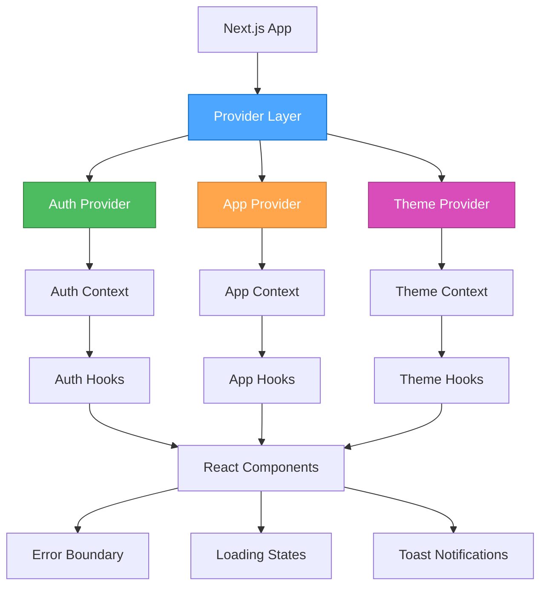

# 系統集成設計

## 設計概述

**選擇的架構**: Context + Hooks 模式
**設計原則**: 奧卡姆剃刀原則，使用 React 內建功能
**目標**: 建立統一、高效、易維護的系統集成方案

## 系統架構圖



## 核心 Provider 設計

### 1. 應用狀態 Provider

```tsx
// src/providers/app-provider.tsx
'use client';

import { createContext, useContext, useReducer, ReactNode } from 'react';

// 狀態類型定義
interface AppState {
  isLoading: boolean;
  error: string | null;
  notifications: Notification[];
  sidebarCollapsed: boolean;
  currentSpace: Space | null;
  currentOrganization: Organization | null;
}

// Action 類型
type AppAction =
  | { type: 'SET_LOADING'; payload: boolean }
  | { type: 'SET_ERROR'; payload: string | null }
  | { type: 'ADD_NOTIFICATION'; payload: Notification }
  | { type: 'REMOVE_NOTIFICATION'; payload: string }
  | { type: 'TOGGLE_SIDEBAR' }
  | { type: 'SET_CURRENT_SPACE'; payload: Space | null }
  | { type: 'SET_CURRENT_ORGANIZATION'; payload: Organization | null };

// 初始狀態
const initialState: AppState = {
  isLoading: false,
  error: null,
  notifications: [],
  sidebarCollapsed: false,
  currentSpace: null,
  currentOrganization: null,
};

// Reducer 函數
function appReducer(state: AppState, action: AppAction): AppState {
  switch (action.type) {
    case 'SET_LOADING':
      return { ...state, isLoading: action.payload };
    case 'SET_ERROR':
      return { ...state, error: action.payload };
    case 'ADD_NOTIFICATION':
      return { ...state, notifications: [...state.notifications, action.payload] };
    case 'REMOVE_NOTIFICATION':
      return {
        ...state,
        notifications: state.notifications.filter(n => n.id !== action.payload),
      };
    case 'TOGGLE_SIDEBAR':
      return { ...state, sidebarCollapsed: !state.sidebarCollapsed };
    case 'SET_CURRENT_SPACE':
      return { ...state, currentSpace: action.payload };
    case 'SET_CURRENT_ORGANIZATION':
      return { ...state, currentOrganization: action.payload };
    default:
      return state;
  }
}

// Context 定義
interface AppContextType {
  state: AppState;
  dispatch: React.Dispatch<AppAction>;
}

const AppContext = createContext<AppContextType | undefined>(undefined);

// Provider 組件
export function AppProvider({ children }: { children: ReactNode }) {
  const [state, dispatch] = useReducer(appReducer, initialState);

  return (
    <AppContext.Provider value={{ state, dispatch }}>
      {children}
    </AppContext.Provider>
  );
}

// Hook 使用
export function useApp() {
  const context = useContext(AppContext);
  if (context === undefined) {
    throw new Error('useApp must be used within an AppProvider');
  }
  return context;
}
```

### 2. 認證 Provider

```tsx
// src/providers/auth-provider.tsx
'use client';

import { createContext, useContext, useEffect, useState, ReactNode } from 'react';
import { User, onAuthStateChanged } from 'firebase/auth';
import { auth } from '@/firebase/config';
import { AuthService, UserProfile } from '@/firebase/auth';

interface AuthContextType {
  user: User | null;
  userProfile: UserProfile | null;
  isLoading: boolean;
  signIn: (email: string, password: string) => Promise<void>;
  signUp: (email: string, password: string, displayName?: string) => Promise<void>;
  signOut: () => Promise<void>;
  refreshUserProfile: () => Promise<void>;
}

const AuthContext = createContext<AuthContextType | undefined>(undefined);

export function AuthProvider({ children }: { children: ReactNode }) {
  const [user, setUser] = useState<User | null>(null);
  const [userProfile, setUserProfile] = useState<UserProfile | null>(null);
  const [isLoading, setIsLoading] = useState(true);

  useEffect(() => {
    const unsubscribe = onAuthStateChanged(auth, async (user) => {
      setUser(user);
      if (user) {
        try {
          const profile = await AuthService.getUserProfile(user.uid);
          setUserProfile(profile);
        } catch (error) {
          console.error('Failed to load user profile:', error);
          setUserProfile(null);
        }
      } else {
        setUserProfile(null);
      }
      setIsLoading(false);
    });

    return unsubscribe;
  }, []);

  const signIn = async (email: string, password: string) => {
    setIsLoading(true);
    try {
      await AuthService.signIn(email, password);
    } finally {
      setIsLoading(false);
    }
  };

  const signUp = async (email: string, password: string, displayName?: string) => {
    setIsLoading(true);
    try {
      await AuthService.signUp(email, password, displayName);
    } finally {
      setIsLoading(false);
    }
  };

  const signOut = async () => {
    setIsLoading(true);
    try {
      await AuthService.signOut();
    } finally {
      setIsLoading(false);
    }
  };

  const refreshUserProfile = async () => {
    if (!user) return;
    try {
      const profile = await AuthService.getUserProfile(user.uid);
      setUserProfile(profile);
    } catch (error) {
      console.error('Failed to refresh user profile:', error);
    }
  };

  return (
    <AuthContext.Provider value={{
      user,
      userProfile,
      isLoading,
      signIn,
      signUp,
      signOut,
      refreshUserProfile,
    }}>
      {children}
    </AuthContext.Provider>
  );
}

export function useAuth() {
  const context = useContext(AuthContext);
  if (context === undefined) {
    throw new Error('useAuth must be used within an AuthProvider');
  }
  return context;
}
```

### 3. 主題 Provider

```tsx
// src/providers/theme-provider.tsx
'use client';

import { createContext, useContext, useEffect, useState, ReactNode } from 'react';

type Theme = 'light' | 'dark' | 'system';

interface ThemeContextType {
  theme: Theme;
  setTheme: (theme: Theme) => void;
  resolvedTheme: 'light' | 'dark';
}

const ThemeContext = createContext<ThemeContextType | undefined>(undefined);

export function ThemeProvider({ children }: { children: ReactNode }) {
  const [theme, setTheme] = useState<Theme>('system');
  const [resolvedTheme, setResolvedTheme] = useState<'light' | 'dark'>('light');

  useEffect(() => {
    const root = window.document.documentElement;
    
    if (theme === 'system') {
      const systemTheme = window.matchMedia('(prefers-color-scheme: dark)').matches
        ? 'dark'
        : 'light';
      setResolvedTheme(systemTheme);
    } else {
      setResolvedTheme(theme);
    }
  }, [theme]);

  useEffect(() => {
    const root = window.document.documentElement;
    root.classList.remove('light', 'dark');
    root.classList.add(resolvedTheme);
  }, [resolvedTheme]);

  return (
    <ThemeContext.Provider value={{
      theme,
      setTheme,
      resolvedTheme,
    }}>
      {children}
    </ThemeContext.Provider>
  );
}

export function useTheme() {
  const context = useContext(ThemeContext);
  if (context === undefined) {
    throw new Error('useTheme must be used within a ThemeProvider');
  }
  return context;
}
```

## 自定義 Hooks 設計

### 1. 數據獲取 Hooks

```tsx
// src/hooks/use-spaces.ts
import { useState, useEffect } from 'react';
import { useAuth } from '@/providers/auth-provider';
import { FirestoreService } from '@/firebase/firestore';

interface Space {
  id: string;
  name: string;
  description?: string;
  slug: string;
  organizationId: string;
  isPublic: boolean;
  createdAt: Date;
  updatedAt: Date;
}

export function useSpaces(organizationId?: string) {
  const [spaces, setSpaces] = useState<Space[]>([]);
  const [isLoading, setIsLoading] = useState(true);
  const [error, setError] = useState<string | null>(null);
  const { user } = useAuth();

  useEffect(() => {
    if (!user) {
      setSpaces([]);
      setIsLoading(false);
      return;
    }

    const loadSpaces = async () => {
      try {
        setIsLoading(true);
        setError(null);
        
        const constraints = [];
        if (organizationId) {
          constraints.push(where('organizationId', '==', organizationId));
        }
        
        const spacesData = await FirestoreService.query<Space>(
          'spaces',
          constraints,
          'createdAt',
          'desc'
        );
        
        setSpaces(spacesData);
      } catch (err) {
        setError(err instanceof Error ? err.message : 'Failed to load spaces');
      } finally {
        setIsLoading(false);
      }
    };

    loadSpaces();
  }, [user, organizationId]);

  const createSpace = async (spaceData: Omit<Space, 'id' | 'createdAt' | 'updatedAt'>) => {
    if (!user) throw new Error('User not authenticated');
    
    try {
      const id = crypto.randomUUID();
      await FirestoreService.create('spaces', id, spaceData);
      
      // 更新本地狀態
      setSpaces(prev => [...prev, { ...spaceData, id, createdAt: new Date(), updatedAt: new Date() }]);
    } catch (err) {
      throw new Error(err instanceof Error ? err.message : 'Failed to create space');
    }
  };

  const updateSpace = async (id: string, updates: Partial<Space>) => {
    try {
      await FirestoreService.update('spaces', id, updates);
      
      // 更新本地狀態
      setSpaces(prev => prev.map(space => 
        space.id === id 
          ? { ...space, ...updates, updatedAt: new Date() }
          : space
      ));
    } catch (err) {
      throw new Error(err instanceof Error ? err.message : 'Failed to update space');
    }
  };

  const deleteSpace = async (id: string) => {
    try {
      await FirestoreService.delete('spaces', id);
      
      // 更新本地狀態
      setSpaces(prev => prev.filter(space => space.id !== id));
    } catch (err) {
      throw new Error(err instanceof Error ? err.message : 'Failed to delete space');
    }
  };

  return {
    spaces,
    isLoading,
    error,
    createSpace,
    updateSpace,
    deleteSpace,
  };
}
```

### 2. 通知系統 Hook

```tsx
// src/hooks/use-notifications.ts
import { useCallback } from 'react';
import { useApp } from '@/providers/app-provider';

export interface Notification {
  id: string;
  type: 'success' | 'error' | 'warning' | 'info';
  title: string;
  message?: string;
  duration?: number;
  action?: {
    label: string;
    onClick: () => void;
  };
}

export function useNotifications() {
  const { dispatch } = useApp();

  const addNotification = useCallback((notification: Omit<Notification, 'id'>) => {
    const id = crypto.randomUUID();
    const fullNotification: Notification = {
      id,
      duration: 5000,
      ...notification,
    };

    dispatch({ type: 'ADD_NOTIFICATION', payload: fullNotification });

    // 自動移除通知
    if (fullNotification.duration && fullNotification.duration > 0) {
      setTimeout(() => {
        dispatch({ type: 'REMOVE_NOTIFICATION', payload: id });
      }, fullNotification.duration);
    }
  }, [dispatch]);

  const removeNotification = useCallback((id: string) => {
    dispatch({ type: 'REMOVE_NOTIFICATION', payload: id });
  }, [dispatch]);

  const showSuccess = useCallback((title: string, message?: string) => {
    addNotification({ type: 'success', title, message });
  }, [addNotification]);

  const showError = useCallback((title: string, message?: string) => {
    addNotification({ type: 'error', title, message });
  }, [addNotification]);

  const showWarning = useCallback((title: string, message?: string) => {
    addNotification({ type: 'warning', title, message });
  }, [addNotification]);

  const showInfo = useCallback((title: string, message?: string) => {
    addNotification({ type: 'info', title, message });
  }, [addNotification]);

  return {
    addNotification,
    removeNotification,
    showSuccess,
    showError,
    showWarning,
    showInfo,
  };
}
```

## 錯誤邊界設計

### 全局錯誤邊界

```tsx
// src/components/error-boundary.tsx
'use client';

import { Component, ErrorInfo, ReactNode } from 'react';
import { Button } from '@/components/ui/button';
import { Card, CardContent, CardDescription, CardHeader, CardTitle } from '@/components/ui/card';
import { AlertTriangle, RefreshCw } from 'lucide-react';

interface Props {
  children: ReactNode;
  fallback?: ReactNode;
}

interface State {
  hasError: boolean;
  error?: Error;
}

export class ErrorBoundary extends Component<Props, State> {
  constructor(props: Props) {
    super(props);
    this.state = { hasError: false };
  }

  static getDerivedStateFromError(error: Error): State {
    return { hasError: true, error };
  }

  componentDidCatch(error: Error, errorInfo: ErrorInfo) {
    console.error('ErrorBoundary caught an error:', error, errorInfo);
    
    // 可以在這裡添加錯誤報告服務
    // reportError(error, errorInfo);
  }

  handleRetry = () => {
    this.setState({ hasError: false, error: undefined });
  };

  render() {
    if (this.state.hasError) {
      if (this.props.fallback) {
        return this.props.fallback;
      }

      return (
        <div className="min-h-screen flex items-center justify-center p-4">
          <Card className="w-full max-w-md">
            <CardHeader className="text-center">
              <div className="mx-auto mb-4 flex h-12 w-12 items-center justify-center rounded-full bg-destructive/10">
                <AlertTriangle className="h-6 w-6 text-destructive" />
              </div>
              <CardTitle>出現錯誤</CardTitle>
              <CardDescription>
                應用程式遇到了一個意外錯誤
              </CardDescription>
            </CardHeader>
            <CardContent className="space-y-4">
              {process.env.NODE_ENV === 'development' && this.state.error && (
                <div className="rounded-md bg-muted p-3">
                  <pre className="text-xs text-muted-foreground">
                    {this.state.error.message}
                  </pre>
                </div>
              )}
              <div className="flex gap-2">
                <Button onClick={this.handleRetry} className="flex-1">
                  <RefreshCw className="mr-2 h-4 w-4" />
                  重試
                </Button>
                <Button 
                  variant="outline" 
                  onClick={() => window.location.reload()}
                  className="flex-1"
                >
                  重新載入
                </Button>
              </div>
            </CardContent>
          </Card>
        </div>
      );
    }

    return this.props.children;
  }
}
```

### 路由級錯誤邊界

```tsx
// src/app/error.tsx
'use client';

import { useEffect } from 'react';
import { Button } from '@/components/ui/button';
import { Card, CardContent, CardDescription, CardHeader, CardTitle } from '@/components/ui/card';

export default function Error({
  error,
  reset,
}: {
  error: Error & { digest?: string };
  reset: () => void;
}) {
  useEffect(() => {
    console.error('Route error:', error);
  }, [error]);

  return (
    <div className="min-h-screen flex items-center justify-center p-4">
      <Card className="w-full max-w-md">
        <CardHeader className="text-center">
          <CardTitle>頁面錯誤</CardTitle>
          <CardDescription>
            此頁面遇到了問題，請重試
          </CardDescription>
        </CardHeader>
        <CardContent>
          <Button onClick={reset} className="w-full">
            重試
          </Button>
        </CardContent>
      </Card>
    </div>
  );
}
```

## 性能優化策略

### 1. Context 優化

```tsx
// 分離 Context 避免不必要的重新渲染
const AppStateContext = createContext<AppState | undefined>(undefined);
const AppDispatchContext = createContext<React.Dispatch<AppAction> | undefined>(undefined);

export function AppProvider({ children }: { children: ReactNode }) {
  const [state, dispatch] = useReducer(appReducer, initialState);

  return (
    <AppStateContext.Provider value={state}>
      <AppDispatchContext.Provider value={dispatch}>
        {children}
      </AppDispatchContext.Provider>
    </AppStateContext.Provider>
  );
}

export function useAppState() {
  const context = useContext(AppStateContext);
  if (context === undefined) {
    throw new Error('useAppState must be used within an AppProvider');
  }
  return context;
}

export function useAppDispatch() {
  const context = useContext(AppDispatchContext);
  if (context === undefined) {
    throw new Error('useAppDispatch must be used within an AppProvider');
  }
  return context;
}
```

### 2. 記憶化優化

```tsx
// 使用 useMemo 和 useCallback 優化性能
export function useOptimizedSpaces(organizationId?: string) {
  const [spaces, setSpaces] = useState<Space[]>([]);
  const [isLoading, setIsLoading] = useState(true);

  const loadSpaces = useCallback(async () => {
    // 加載邏輯
  }, [organizationId]);

  const memoizedSpaces = useMemo(() => spaces, [spaces]);

  useEffect(() => {
    loadSpaces();
  }, [loadSpaces]);

  return {
    spaces: memoizedSpaces,
    isLoading,
    loadSpaces,
  };
}
```

### 3. 虛擬化長列表

```tsx
// 使用 react-window 進行虛擬化
import { FixedSizeList as List } from 'react-window';

function VirtualizedSpaceList({ spaces }: { spaces: Space[] }) {
  const Row = ({ index, style }: { index: number; style: React.CSSProperties }) => (
    <div style={style}>
      <SpaceCard space={spaces[index]} />
    </div>
  );

  return (
    <List
      height={600}
      itemCount={spaces.length}
      itemSize={120}
      width="100%"
    >
      {Row}
    </List>
  );
}
```

## 狀態持久化

### 本地存儲 Hook

```tsx
// src/hooks/use-local-storage.ts
import { useState, useEffect } from 'react';

export function useLocalStorage<T>(key: string, initialValue: T) {
  const [storedValue, setStoredValue] = useState<T>(() => {
    if (typeof window === 'undefined') {
      return initialValue;
    }
    
    try {
      const item = window.localStorage.getItem(key);
      return item ? JSON.parse(item) : initialValue;
    } catch (error) {
      console.error(`Error reading localStorage key "${key}":`, error);
      return initialValue;
    }
  });

  const setValue = (value: T | ((val: T) => T)) => {
    try {
      const valueToStore = value instanceof Function ? value(storedValue) : value;
      setStoredValue(valueToStore);
      
      if (typeof window !== 'undefined') {
        window.localStorage.setItem(key, JSON.stringify(valueToStore));
      }
    } catch (error) {
      console.error(`Error setting localStorage key "${key}":`, error);
    }
  };

  return [storedValue, setValue] as const;
}
```

### 主題持久化

```tsx
// 使用本地存儲持久化主題設置
export function usePersistedTheme() {
  const [theme, setTheme] = useLocalStorage<Theme>('theme', 'system');
  
  return { theme, setTheme };
}
```

## 實施計劃

### 階段 1: 基礎 Provider (2-3 天)
1. 實現 AppProvider
2. 實現 AuthProvider
3. 實現 ThemeProvider

### 階段 2: 自定義 Hooks (3-4 天)
1. 實現數據獲取 Hooks
2. 實現通知系統 Hook
3. 實現本地存儲 Hook

### 階段 3: 錯誤處理 (2-3 天)
1. 實現錯誤邊界組件
2. 實現路由級錯誤處理
3. 添加錯誤報告機制

### 階段 4: 性能優化 (2-3 天)
1. 優化 Context 結構
2. 添加記憶化優化
3. 實現虛擬化組件

## 驗證標準

### 功能驗證
- [ ] 狀態管理正常工作
- [ ] 組件間通信順暢
- [ ] 錯誤邊界正確捕獲錯誤
- [ ] 通知系統正常顯示

### 性能驗證
- [ ] 組件重新渲染次數合理
- [ ] 長列表渲染性能良好
- [ ] 內存使用穩定
- [ ] 加載時間符合預期

### 穩定性驗證
- [ ] 錯誤恢復機制正常
- [ ] 狀態持久化正確
- [ ] 網絡錯誤處理適當
- [ ] 瀏覽器兼容性良好

## 總結

這個系統集成設計提供了：

1. **統一的狀態管理**: 使用 Context + Hooks 模式
2. **高效的數據流**: 清晰的數據流向和更新機制
3. **健壯的錯誤處理**: 多層錯誤邊界和恢復機制
4. **優秀的性能**: 優化的重新渲染和虛擬化
5. **良好的開發體驗**: 類型安全的 Hooks 和 Provider

這個設計為整個應用提供了堅實的集成基礎，確保了組件間的順暢通信和系統的穩定性。
